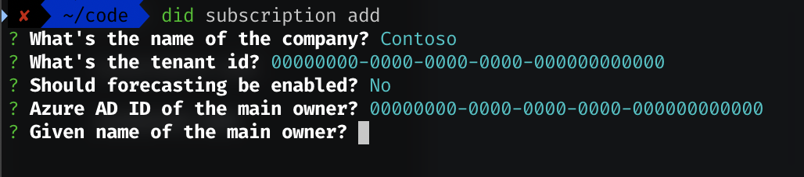
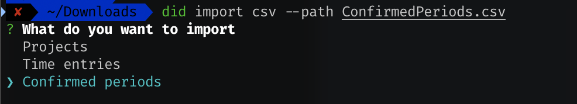
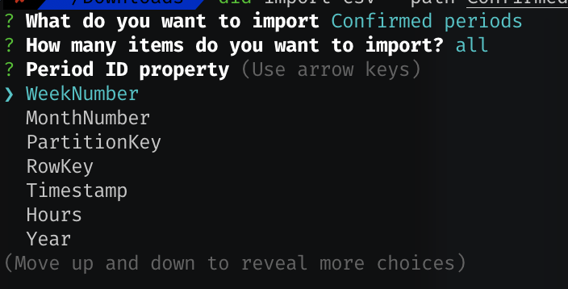
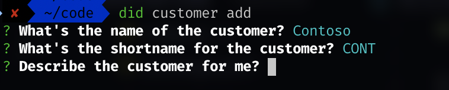

# did-cli [](https://semver.org)

CLI for [did](https://github.com/Puzzlepart/did).

### Installation

```shell
npm i -g "https://github.com/Puzzlepart/did-cli"
```


#### Init

```shell
did init
```


### Actions

#### subscription add

```shell
did subscription add
```

or

```shell
did-cli subscription add
```




#### import csv

```shell
did import csv --path path_to_csv_file
```

or

```shell
did-cli import csv
```






#### customer add

```shell
did customer add
```

or

```shell
did-cli customer add
```


