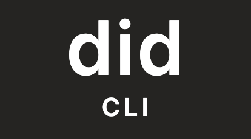
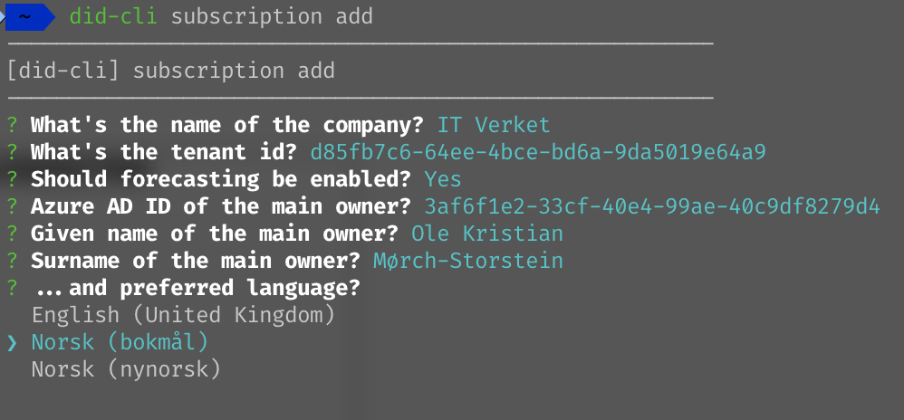
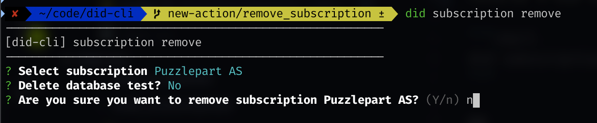
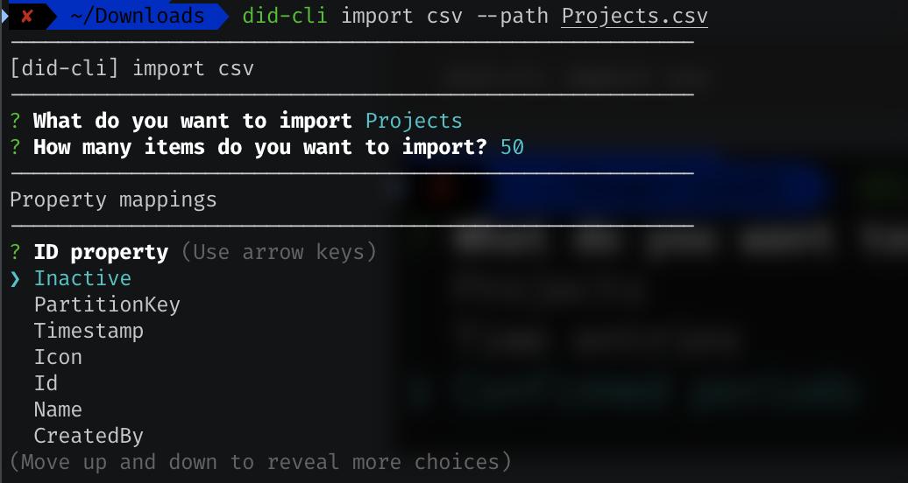
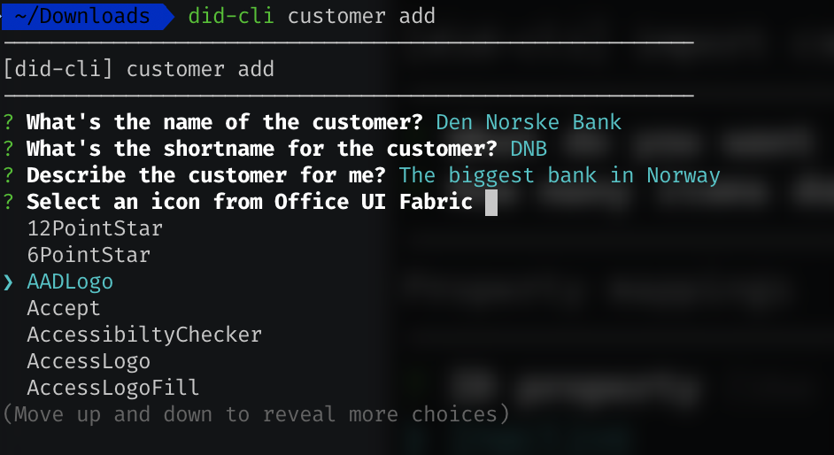

<!-- ⚠️ This README has been generated from the file(s) "readme.blueprint.md" ⚠️--><p align="center">
  
</p> <p align="center">
  <b>Add subscriptions, customers, projects and import data from different sources.... well, just CSV for now.</b></br>
  <sub>It's basically a CLI for did.<sub>
</p>

<br />


[](https://semver.org)

<details>
<summary>📖 Table of Contents</summary>
<br />

[](#table-of-contents)

## ➤ Table of Contents

* [➤ Installation](#-installation)
* [➤ Initialize the cli](#-initialize-the-cli)
* [➤ Actions](#-actions)
	* [open](#open)
	* [subscription add](#subscription-add)
	* [subscription remove](#subscription-remove)
	* [import csv](#import-csv)
	* [customer add](#customer-add)
* [➤ Why is the `bin` folder commited?](#-why-is-the-bin-folder-commited)
* [➤ Contributors](#-contributors)
</details>


[](#installation)

## ➤ Installation
The `cli` is not published to [npm](https://www.npmjs.com/) as it's a private repository.

You install the `cli` through github:

```shell
npm i -g "https://github.com/Puzzlepart/did-cli"
```


[](#initialize-the-cli)

## ➤ Initialize the cli
To start using the `cli`, you need to set it up.

Run

```shell
did init
```


[](#actions)

## ➤ Actions

### open

Opens the local installation of [did]() in `vscode`.

```shell
did open
```

or

```shell
did-cli open
```


### subscription add

```shell
did subscription add
```

or

```shell
did-cli subscription add
```




### subscription remove

Removes a Did subscription.

```shell
did subscription remove
```

or

```shell
did-cli subscription remove
```




### import csv

```shell
did import csv --path path_to_csv_file
```

or

```shell
did-cli import csv
```




### customer add

```shell
did customer add
```

or

```shell
did-cli customer add
```




[](#why-is-the-bin-folder-commited)

## ➤ Why is the `bin` folder commited?
This is because we are installing the `cli` through GitHub.


[](#contributors)

## ➤ Contributors
	

| [Ole Martin Pettersen](undefined)                |
|:--------------------------------------------------:|
| [olemp@puzzlepart.com](mailto:olemp@puzzlepart.com) |
| 🔥                                               |
