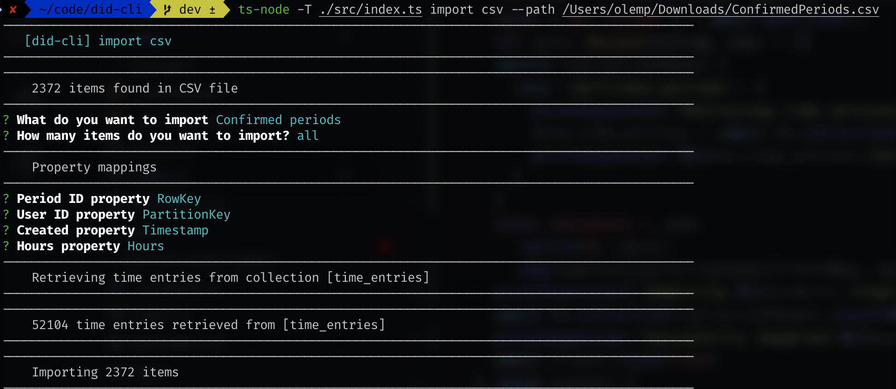
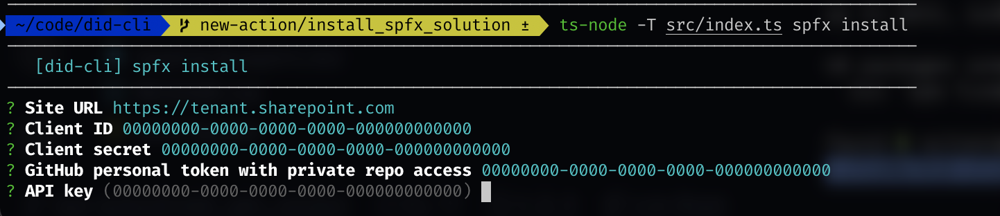

<!-- ⚠️ This README has been generated from the file(s) "readme.blueprint.md" ⚠️--><p align="center">
  
</p> <p align="center">
  <b>Add subscriptions, customers, projects and import data from different sources.... well, just CSV for now.</b></br>
  <sub>It's basically a CLI for did.<sub>
</p>

<br />


[](https://semver.org)

<details>
<summary>📖 Table of Contents</summary>
<br />

[](#table-of-contents)

## ➤ Table of Contents

* [➤ Installation](#-installation)
* [➤ Initialize the cli](#-initialize-the-cli)
* [➤ Actions](#-actions)
	* [open](#open)
	* [subscription add](#subscription-add)
	* [subscription remove](#subscription-remove)
	* [import csv](#import-csv)
	* [customer add](#customer-add)
	* [project add](#project-add)
	* [spfx install](#spfx-install)
		* [With command line arguments](#with-command-line-arguments)
	* [Upgrade](#upgrade)
		* [Upgrade from `dev` branch](#upgrade-from-dev-branch)
		* [Reset environment](#reset-environment)
	* [about](#about)
* [➤ Why is the `bin` folder commited?](#-why-is-the-bin-folder-commited)
* [➤ Contributors](#-contributors)
</details>


[](#installation)

## ➤ Installation
The `cli` is not published to [npm](https://www.npmjs.com/) as it's a private repository.

You install the `cli` through github:

```shell
npm i -g "https://github.com/Puzzlepart/did-cli"
```


[](#initialize-the-cli)

## ➤ Initialize the cli
To start using the `cli`, you need to set it up.

Run

```shell
did init
```


[](#actions)

## ➤ Actions

### open

Opens the local installation of [did]() in `vscode`.

```shell
did open
```

or

```shell
did-cli open
```


### subscription add

```shell
did subscription add
```

or

```shell
did-cli subscription add
```


### subscription remove

Removes a Did subscription.

```shell
did subscription remove
```

or

```shell
did-cli subscription remove
```


### import csv

```shell
did import csv --path path_to_csv_file
```

or

```shell
did-cli import csv
```




### customer add

Adds a new customer to Did. You will be prompted for all neccessary information.

```shell
did customer add
```

or

```shell
did-cli customer add
```


### project add

Adds a new project to Did. You will be prompted for all neccessary information.

```shell
did project add
```

or

```shell
did-cli project add
```


### spfx install

Install SPFx solution. Installs the SPFx solution to the specified tenant.

Requires an old fashioned SharePoint app registration.

See: [How to register a legacy SharePoint application](./sp-app-registration.md)

```shell
did spfx install
```

or

```shell
did-cli spfx install
```

_You'll be prompted for all neccessary inputs._

#### With command line arguments

```shell
did spfx install --clientId {clientId} --clientSecret {clientSecret} --siteUrl {siteUrl} --githubToken {githubToken} --didApiKey {didApiKey}
```




### Upgrade

Upgrade did-cli to the latest version from GitHub `main` branch.

```shell
did upgrade
```

or

```shell
did-cli upgrade
```

#### Upgrade from `dev` branch

```shell
did upgrade --branch dev
```

#### Reset environment
To reset environment when upgrading, use argument `---reset`. The default behavior is to keep the environment that was set running `did init`.

```shell
did upgrade --reset
```

### about

About the did-cli

```shell
did about
```

or

```shell
did-cli about
```


[](#why-is-the-bin-folder-commited)

## ➤ Why is the `bin` folder commited?
This is because we are installing the `cli` through GitHub.


[](#contributors)

## ➤ Contributors
	

| [Ole Martin Pettersen](undefined)                | [Carl Joakim Damsleth](undefined)                |
|:--------------------------------------------------:|:--------------------------------------------------:|
| [olemp@puzzlepart.com](mailto:olemp@puzzlepart.com) | [carl.joakim.damsleth@puzzlepart.com](mailto:carl.joakim.damsleth@puzzlepart.com) |
| Main contributor and owner                       | ⭐ Upcoming contribution star ⭐                   |
